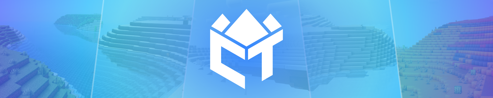

# Crafted Terrain Generation

*Crafted Terrain Generation* (CTGen) allows you to generate entire Minecraft worlds with just one map image!
It's fully data-driven, so you can configure it entirely via data packs - no need for java code!
If you're a java coder, don't worry - CTGen also features a Java API, where you can configure everything of the mod!

CTGen builds your dream world, just the way you draw it on a map!
No matter if you want to play in a fantastic world like the world in [Game of Thrones] or are searching for a way to implement your custom mod-pack lore, CTGen realises your dream!
There's already an amazing mod using CTGen for the world of [Game of Thrones] - the [A Storm of Swords] mod.

---

If you want to use CTGen on a server so you can enjoy your custom generated minecraft worlds with friends, I suggest trying out BisectHosting.
You can use the code "woodwalkers" to receive a 25% discount on your first month, and you'll also support the development of CTGen.

---

---

### License

CTGen is licensed under [Crafted License 1.0](LICENSE.md). 

[Game of Thrones]: https://www.hbo.com/game-of-thrones
[A Storm of Swords]: https://github.com/Deathslayor/AStormOfSwords